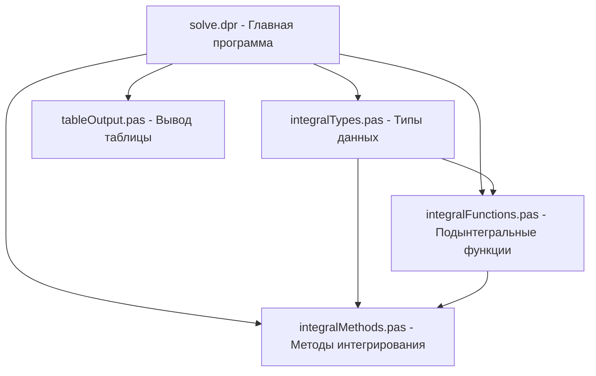

# План решения задачи по численному интегрированию

## Анализ задания

Задание требует:
1. Реализовать два метода численного интегрирования:
   - Метод левых прямоугольников
   - Метод трапеций
2. Вычислить 4 интеграла с точностью ε = 10^-2 и ε = 10^-3
3. Использовать функции с процедурными параметрами
4. Представить результаты в виде таблицы

## Структура программы

Для модульной организации кода предлагается следующая структура:



## Модули программы

### 1. integralTypes.pas
- Определение типа для процедурного параметра (указатель на функцию)
- Константы для границ интегрирования и точности

### 2. integralFunctions.pas
- Реализация 4-х подынтегральных функций
- Функция-селектор для выбора нужной функции по номеру

### 3. integralMethods.pas
- Реализация метода левых прямоугольников
- Реализация метода трапеций
- Функции для вычисления интегралов с заданной точностью

### 4. tableOutput.pas
- Функции для форматированного вывода таблицы результатов

### 5. solve.dpr
- Основная программа, которая использует все модули
- Вычисление всех интегралов обоими методами с разной точностью
- Вывод результатов в таблицу

## Детальная реализация модулей

### 1. integralTypes.pas

```pascal
unit integralTypes;

interface

type
  TFunction = function(x: Real): Real;
  TIntegrationMethod = function(f: TFunction; a, b: Real; n: Integer): Real;

const
  // Границы интегрирования
  A1 = 0.6; B1 = 1.4; // Для первого интеграла
  A2 = 0.2; B2 = 0.8; // Для второго интеграла
  A3 = 0.8; B3 = 1.6; // Для третьего интеграла
  A4 = 1.2; B4 = 2.0; // Для четвертого интеграла
  
  // Точности
  EPS1 = 1E-2;
  EPS2 = 1E-3;

implementation

end.
```

### 2. integralFunctions.pas

```pascal
unit integralFunctions;

interface

uses
  Math, integralTypes;

// Функция 1: (√(x²+5))/(2x+√(x²+0.5))
function Function1(x: Real): Real;

// Функция 2: (sin(2x+0.5))/(2+cos(x²+1))
function Function2(x: Real): Real;

// Функция 3: 1/√(2x²+1)
function Function3(x: Real): Real;

// Функция 4: (ln(x+2))/x
function Function4(x: Real): Real;

// Функция-селектор для выбора нужной функции по номеру
function GetFunction(functionNumber: Integer): TFunction;

implementation

function Function1(x: Real): Real;
begin
  Result := Sqrt(x*x + 5) / (2*x + Sqrt(x*x + 0.5));
end;

function Function2(x: Real): Real;
begin
  Result := Sin(2*x + 0.5) / (2 + Cos(x*x + 1));
end;

function Function3(x: Real): Real;
begin
  Result := 1 / Sqrt(2*x*x + 1);
end;

function Function4(x: Real): Real;
begin
  Result := Ln(x + 2) / x;
end;

function GetFunction(functionNumber: Integer): TFunction;
begin
  case functionNumber of
    1: Result := @Function1;
    2: Result := @Function2;
    3: Result := @Function3;
    4: Result := @Function4;
    else Result := nil;
  end;
end;

end.
```

### 3. integralMethods.pas

```pascal
unit integralMethods;

interface

uses
  integralTypes;

// Метод левых прямоугольников
function LeftRectangleMethod(f: TFunction; a, b: Real; n: Integer): Real;

// Метод трапеций
function TrapezoidMethod(f: TFunction; a, b: Real; n: Integer): Real;

// Вычисление интеграла с заданной точностью
function CalculateWithPrecision(method: TIntegrationMethod; f: TFunction; a, b: Real; eps: Real; var iterations: Integer): Real;

implementation

function LeftRectangleMethod(f: TFunction; a, b: Real; n: Integer): Real;
var
  h, sum: Real;
  i: Integer;
begin
  h := (b - a) / n;
  sum := 0;
  for i := 0 to n - 1 do
    sum := sum + f(a + i * h);
  Result := h * sum;
end;

function TrapezoidMethod(f: TFunction; a, b: Real; n: Integer): Real;
var
  h, sum: Real;
  i: Integer;
begin
  h := (b - a) / n;
  sum := (f(a) + f(b)) / 2;
  for i := 1 to n - 1 do
    sum := sum + f(a + i * h);
  Result := h * sum;
end;

function CalculateWithPrecision(method: TIntegrationMethod; f: TFunction; a, b: Real; eps: Real; var iterations: Integer): Real;
var
  prevResult, currResult: Real;
  n: Integer;
begin
  n := 1;
  currResult := method(f, a, b, n);
  
  repeat
    prevResult := currResult;
    n := n * 2;
    currResult := method(f, a, b, n);
  until Abs(currResult - prevResult) <= eps;
  
  iterations := n;
  Result := currResult;
end;

end.
```

### 4. tableOutput.pas

```pascal
unit tableOutput;

interface

procedure PrintTableHeader;
procedure PrintTableRow(rowName: string; 
                        value1, n1, value2, n2, 
                        value3, n3, value4, n4: Real);
procedure PrintTableFooter;

implementation

uses SysUtils;

procedure PrintTableHeader;
begin
  WriteLn('+----------------+----------+----------+----------+----------+----------+----------+----------+----------+');
  WriteLn('|                | 1ый метод | 1ый метод | 1ый метод | 1ый метод | 2ой метод | 2ой метод | 2ой метод | 2ой метод |');
  WriteLn('+----------------+----------+----------+----------+----------+----------+----------+----------+----------+');
  WriteLn('|                | eps=10^-2 | eps=10^-2 | eps=10^-3 | eps=10^-3 | eps=10^-2 | eps=10^-2 | eps=10^-3 | eps=10^-3 |');
  WriteLn('|                | значение  | N         | значение  | N         | значение  | N         | значение  | N         |');
  WriteLn('+----------------+----------+----------+----------+----------+----------+----------+----------+----------+');
end;

procedure PrintTableRow(rowName: string; 
                        value1, n1, value2, n2, 
                        value3, n3, value4, n4: Real);
begin
  WriteLn(Format('| %-14s | %8.5f | %8.0f | %8.5f | %8.0f | %8.5f | %8.0f | %8.5f | %8.0f |',
                [rowName, value1, n1, value2, n2, value3, n3, value4, n4]));
end;

procedure PrintTableFooter;
begin
  WriteLn('+----------------+----------+----------+----------+----------+----------+----------+----------+----------+');
end;

end.
```

### 5. solve.dpr (основная программа)

```pascal
program solve;

uses
  SysUtils, Math,
  integralTypes,
  integralFunctions,
  integralMethods,
  tableOutput;

var
  f: TFunction;
  value1, value2, value3, value4: Real;
  n1, n2, n3, n4: Integer;
  i: Integer;

begin
  PrintTableHeader;
  
  for i := 1 to 4 do
  begin
    f := GetFunction(i);
    
    case i of
      1: begin
        // Метод левых прямоугольников с eps=10^-2
        value1 := CalculateWithPrecision(@LeftRectangleMethod, f, A1, B1, EPS1, n1);
        // Метод левых прямоугольников с eps=10^-3
        value2 := CalculateWithPrecision(@LeftRectangleMethod, f, A1, B1, EPS2, n2);
        // Метод трапеций с eps=10^-2
        value3 := CalculateWithPrecision(@TrapezoidMethod, f, A1, B1, EPS1, n3);
        // Метод трапеций с eps=10^-3
        value4 := CalculateWithPrecision(@TrapezoidMethod, f, A1, B1, EPS2, n4);
      end;
      2: begin
        // Метод левых прямоугольников с eps=10^-2
        value1 := CalculateWithPrecision(@LeftRectangleMethod, f, A2, B2, EPS1, n1);
        // Метод левых прямоугольников с eps=10^-3
        value2 := CalculateWithPrecision(@LeftRectangleMethod, f, A2, B2, EPS2, n2);
        // Метод трапеций с eps=10^-2
        value3 := CalculateWithPrecision(@TrapezoidMethod, f, A2, B2, EPS1, n3);
        // Метод трапеций с eps=10^-3
        value4 := CalculateWithPrecision(@TrapezoidMethod, f, A2, B2, EPS2, n4);
      end;
      3: begin
        // Метод левых прямоугольников с eps=10^-2
        value1 := CalculateWithPrecision(@LeftRectangleMethod, f, A3, B3, EPS1, n1);
        // Метод левых прямоугольников с eps=10^-3
        value2 := CalculateWithPrecision(@LeftRectangleMethod, f, A3, B3, EPS2, n2);
        // Метод трапеций с eps=10^-2
        value3 := CalculateWithPrecision(@TrapezoidMethod, f, A3, B3, EPS1, n3);
        // Метод трапеций с eps=10^-3
        value4 := CalculateWithPrecision(@TrapezoidMethod, f, A3, B3, EPS2, n4);
      end;
      4: begin
        // Метод левых прямоугольников с eps=10^-2
        value1 := CalculateWithPrecision(@LeftRectangleMethod, f, A4, B4, EPS1, n1);
        // Метод левых прямоугольников с eps=10^-3
        value2 := CalculateWithPrecision(@LeftRectangleMethod, f, A4, B4, EPS2, n2);
        // Метод трапеций с eps=10^-2
        value3 := CalculateWithPrecision(@TrapezoidMethod, f, A4, B4, EPS1, n3);
        // Метод трапеций с eps=10^-3
        value4 := CalculateWithPrecision(@TrapezoidMethod, f, A4, B4, EPS2, n4);
      end;
    end;
    
    PrintTableRow(Format('%d-ый интеграл', [i]), value1, n1, value2, n2, value3, n3, value4, n4);
  end;
  
  PrintTableFooter;
  
  ReadLn;
end.
```

## Особенности реализации

1. **Процедурный тип**: Используется тип `TFunction` для представления подынтегральных функций и `TIntegrationMethod` для методов интегрирования.

2. **Модульная структура**: Код разделен на логические модули для лучшей организации.

3. **Алгоритм вычисления с заданной точностью**: Используется метод последовательного удвоения числа интервалов до достижения заданной точности.

4. **Форматированный вывод**: Таблица выводится с использованием ASCII-символов для лучшей читаемости.

## Потенциальные улучшения

1. **Оптимизация вычислений**: Можно добавить кэширование результатов функций для повышения производительности.

2. **Обработка ошибок**: Добавить проверки на деление на ноль и другие потенциальные ошибки.

3. **Параллельные вычисления**: Для больших значений n можно использовать параллельные вычисления.